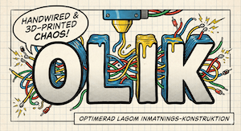
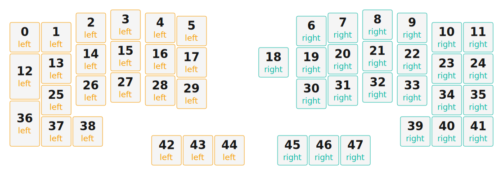

# OLIK 47

### **O**ptimerad **L**agom **I**nmatnings-**K**onstruktion




*(Optimized Lagom Input Construction)*

**OLIK 47** is a handwired, 3D-printed split ergonomic keyboard designed with a nod to robust Swedish industrial engineering. It embraces asymmetry ("Olik" means *Different* or *Unlike* in Swedish) to provide exactly what is needed—and nothing more.

Built around the Swedish concept of **Lagom** (not too much, not too little, just right), the OLIK 47 avoids extreme minimalism in favor of practicality. It features a dedicated arrow cluster, a rotary encoder, and a tilted "wedge" profile for ergonomic comfort without complex adjustable legs.


## 🇸🇪 The Philosophy

Most split keyboards try to be perfectly symmetrical. The **OLIK** acknowledges that our needs for the left and right hands are often different.

* **Left Hand:** 22 Keys + OLED. Focused on modifiers and alphas.
* **Right Hand:** 24 Keys + Rotary Encoder. Focused on navigation (arrows), entry, and system control (volume/play/pause).

## ✨ Features

* **Asymmetric Layout:** 46 physical keys + 1 Encoder click (Total 47 inputs).
* **Handwired Matrix:** No PCB. Just wires, diodes, and patience.
* **Industrial Retro Aesthetic:** Designed to look like heavy machinery or 80s avionics, featuring a robust "wedge" case with integrated tenting and tilt.
* **Hardware:**
* 1x EC11 Rotary Encoder (Right half)
* 1x OLED Display (Left half)
* Controllers: Pro Micro NRF52840


## 📂 Project Status

* [x] **Design & CAD:** Completed.
* [x] **3D Printing:** Completed.
* [ ] **Wiring:** In progress.
* [ ] **Firmware:** In progress.

## 🛠️ Build Guide

*(Coming soon: Wiring diagrams. STLs, STEP etc).*

---

*"Lagom med knappar, optimerad för Kim."*

---

*Initial firmware code Generated by Shield Wizard for ZMK*



Download compiled firmware from the Actions tab. <https://zmk.dev/docs/user-setup#installing-the-firmware>

Edit your keymap <https://zmk.dev/docs/keymaps>.
User keymap is located at [`config/olik.keymap`](config/olik.keymap).

-----

<details>
<summary>
Shield Wizard Debug Information
</summary>

In case of broken configuration, here is the Shield Wizard internal data used to generate this configuration:

Commit: a18ba60304e44de9bbf35eb3d70a8d8ba4e8c49a

```json
{"name":"olik","shield":"olik","dongle":false,"layout":[{"id":"01KG8SV3DMFG8EQYVZ9PS3VJC2","part":0,"row":0,"col":0,"w":1,"h":1,"x":0,"y":0.4,"r":0,"rx":0,"ry":0},{"id":"01KG8SV3DMTFR9HK39C5NR5Q4N","part":0,"row":0,"col":1,"w":1,"h":1,"x":1,"y":0.4,"r":0,"rx":0,"ry":0},{"id":"01KG8SV3DMD54N76ZTKY76BN3C","part":0,"row":0,"col":2,"w":1,"h":1,"x":2.1,"y":0.1,"r":0,"rx":0,"ry":0},{"id":"01KG8SV3DKTWENG1V9RH2J4F3C","part":0,"row":0,"col":3,"w":1,"h":1,"x":3.2,"y":0,"r":0,"rx":0,"ry":0},{"id":"01KG8SV3DM33DCGT0EZGC06SA3","part":0,"row":0,"col":4,"w":1,"h":1,"x":4.3,"y":0.1,"r":0,"rx":0,"ry":0},{"id":"01KG8SV3DM82JWK0W3MX48ETCA","part":0,"row":0,"col":5,"w":1,"h":1,"x":5.3,"y":0.2,"r":0,"rx":0,"ry":0},{"id":"01KG8SV3DMVFP08DSQX2GDWXFJ","part":1,"row":0,"col":7,"w":1,"h":1,"x":9.1,"y":0.2,"r":0,"rx":0,"ry":0},{"id":"01KG8SV3DMZXGNWK4RT0ZNN253","part":1,"row":0,"col":8,"w":1,"h":1,"x":10.1,"y":0.1,"r":0,"rx":0,"ry":0},{"id":"01KG8SV3DMR1PFK4B6TCBTHM0B","part":1,"row":0,"col":9,"w":1,"h":1,"x":11.2,"y":0,"r":0,"rx":0,"ry":0},{"id":"01KG8SV3DMJ6YZ33BD35G08V0H","part":1,"row":0,"col":10,"w":1,"h":1,"x":12.3,"y":0.1,"r":0,"rx":0,"ry":0},{"id":"01KG8SV3DMA051S20SFQ9X8SRH","part":1,"row":0,"col":11,"w":1,"h":1,"x":13.4,"y":0.4,"r":0,"rx":0,"ry":0},{"id":"01KG8SV3DMHFVA012QKV551QPE","part":1,"row":0,"col":12,"w":1,"h":1,"x":14.4,"y":0.4,"r":0,"rx":0,"ry":0},{"id":"01KG8SV3DMTTK9FS9Z7SR4X0KE","part":0,"row":1,"col":0,"w":1,"h":1.5,"x":0,"y":1.4,"r":0,"rx":0,"ry":0},{"id":"01KG8SV3DMGHHN39Y1AHSWB51M","part":0,"row":1,"col":1,"w":1,"h":1,"x":1,"y":1.4,"r":0,"rx":0,"ry":0},{"id":"01KG8SV3DMMKSCJGWEH09VMGQN","part":0,"row":1,"col":2,"w":1,"h":1,"x":2.1,"y":1.1,"r":0,"rx":0,"ry":0},{"id":"01KG8SV3DM190C9BZA1M21E134","part":0,"row":1,"col":3,"w":1,"h":1,"x":3.2,"y":1,"r":0,"rx":0,"ry":0},{"id":"01KG8SV3DM7YM1AQHYBVMRB907","part":0,"row":1,"col":4,"w":1,"h":1,"x":4.3,"y":1.1,"r":0,"rx":0,"ry":0},{"id":"01KG8SV3DM23F7770AA6WXZJ3H","part":0,"row":1,"col":5,"w":1,"h":1,"x":5.3,"y":1.2,"r":0,"rx":0,"ry":0},{"id":"01KG8SV3DM40S30Y0WQTK5XNCR","part":1,"row":1,"col":6,"w":1,"h":1,"x":7.9,"y":1.2,"r":0,"rx":0,"ry":0},{"id":"01KG8SV3DMPZY9P3T73M627EQ8","part":1,"row":1,"col":7,"w":1,"h":1,"x":9.1,"y":1.2,"r":0,"rx":0,"ry":0},{"id":"01KG8SV3DM9QX4P4GHRR9WRV13","part":1,"row":1,"col":8,"w":1,"h":1,"x":10.1,"y":1.1,"r":0,"rx":0,"ry":0},{"id":"01KG8SV3DMC4HMTP331W44ER6D","part":1,"row":1,"col":9,"w":1,"h":1,"x":11.2,"y":1,"r":0,"rx":0,"ry":0},{"id":"01KG8SV3DMH9RGERJ44JQ6RNKN","part":1,"row":1,"col":10,"w":1,"h":1,"x":12.3,"y":1.1,"r":0,"rx":0,"ry":0},{"id":"01KG8SV3DMANA438KXH7VFJ95D","part":1,"row":1,"col":11,"w":1,"h":1,"x":13.4,"y":1.4,"r":0,"rx":0,"ry":0},{"id":"01KG8SV3DM7MFP8JTFDP0DY4P3","part":1,"row":1,"col":12,"w":1,"h":1,"x":14.4,"y":1.4,"r":0,"rx":0,"ry":0},{"id":"01KG8SV3DN7DY7WJM8Q2C23CXW","part":0,"row":2,"col":1,"w":1,"h":1,"x":1,"y":2.4,"r":0,"rx":0,"ry":0},{"id":"01KG8SV3DMPRE2NT7KN3H1CJ9A","part":0,"row":2,"col":2,"w":1,"h":1,"x":2.1,"y":2.1,"r":0,"rx":0,"ry":0},{"id":"01KG8SV3DMVQX00YDBMEGJVN8D","part":0,"row":2,"col":3,"w":1,"h":1,"x":3.2,"y":2,"r":0,"rx":0,"ry":0},{"id":"01KG8SV3DMYYBEYAA9NY36H4CV","part":0,"row":2,"col":4,"w":1,"h":1,"x":4.3,"y":2.1,"r":0,"rx":0,"ry":0},{"id":"01KG8SV3DMSEVNXAZEXC4M7RQ7","part":0,"row":2,"col":5,"w":1,"h":1,"x":5.3,"y":2.2,"r":0,"rx":0,"ry":0},{"id":"01KG8SV3DNZ9VH81N3J2MZ6D87","part":1,"row":2,"col":7,"w":1,"h":1,"x":9.1,"y":2.2,"r":0,"rx":0,"ry":0},{"id":"01KG8SV3DM8RHGD4CY53JP064R","part":1,"row":2,"col":8,"w":1,"h":1,"x":10.1,"y":2.1,"r":0,"rx":0,"ry":0},{"id":"01KG8SV3DM5C0FFRN5KF22RXGC","part":1,"row":2,"col":9,"w":1,"h":1,"x":11.2,"y":2,"r":0,"rx":0,"ry":0},{"id":"01KG8SV3DMTFQHQTRWS5YQCK9S","part":1,"row":2,"col":10,"w":1,"h":1,"x":12.3,"y":2.1,"r":0,"rx":0,"ry":0},{"id":"01KG8SV3DN5J97ZS683B5NXRF7","part":1,"row":2,"col":11,"w":1,"h":1,"x":13.4,"y":2.4,"r":0,"rx":0,"ry":0},{"id":"01KG8SV3DN81VHQ54N0H0R3E00","part":1,"row":2,"col":12,"w":1,"h":1,"x":14.4,"y":2.4,"r":0,"rx":0,"ry":0},{"id":"01KG8SV3DN4XHWDWK8G84AMDTJ","part":0,"row":3,"col":0,"w":1,"h":1.5,"x":0,"y":2.9,"r":0,"rx":0,"ry":0},{"id":"01KG8SV3DNVKPQZZ6G35PXT89J","part":0,"row":3,"col":1,"w":1,"h":1,"x":1,"y":3.4,"r":0,"rx":0,"ry":0},{"id":"01KG8SV3DNQJPMFMG6WGSGBXRJ","part":0,"row":3,"col":2,"w":1,"h":1,"x":2,"y":3.4,"r":0,"rx":0,"ry":0},{"id":"01KG8SV3DN7PMEM6FH3YWBGH42","part":1,"row":3,"col":10,"w":1,"h":1,"x":12.4,"y":3.4,"r":0,"rx":0,"ry":0},{"id":"01KG8SV3DN538K1BR24XQG5F37","part":1,"row":3,"col":11,"w":1,"h":1,"x":13.4,"y":3.4,"r":0,"rx":0,"ry":0},{"id":"01KG8SV3DN6803VM5T8WDAKV8D","part":1,"row":3,"col":12,"w":1,"h":1,"x":14.4,"y":3.4,"r":0,"rx":0,"ry":0},{"id":"01KG8T4YY32MXN11HTR72RSTRM","part":0,"row":4,"col":4,"w":1,"h":1,"x":4.5,"y":4,"r":0,"rx":0,"ry":0},{"id":"01KG8T510A5ESSVCNQS5HMX5SJ","part":0,"row":4,"col":5,"w":1,"h":1,"x":5.5,"y":4,"r":0,"rx":0,"ry":0},{"id":"01KG8T51FB9T5EKFJ75KF0ZHG3","part":0,"row":4,"col":6,"w":1,"h":1,"x":6.5,"y":4,"r":0,"rx":0,"ry":0},{"id":"01KG8T5QXNJ7R9D1VBV7W1016F","part":1,"row":4,"col":7,"w":1,"h":1,"x":8.5,"y":4,"r":0,"rx":0,"ry":0},{"id":"01KG8T5RQ6YTG4FQPD6MVDTZKF","part":1,"row":4,"col":8,"w":1,"h":1,"x":9.5,"y":4,"r":0,"rx":0,"ry":0},{"id":"01KG8T5S2VS351YHKH9APDNRY6","part":1,"row":4,"col":9,"w":1,"h":1,"x":10.5,"y":4,"r":0,"rx":0,"ry":0}],"parts":[{"name":"left","controller":"nice_nano_v2","wiring":"matrix_diode","pins":{"p102":"bus","p107":"bus","d1":"input","d0":"input","d2":"input","d3":"input","d21":"output","d20":"output","d19":"output","d18":"output","d15":"output","d14":"output"},"keys":{"01KG8SV3DMFG8EQYVZ9PS3VJC2":{"input":"d1","output":"d21"},"01KG8SV3DMTFR9HK39C5NR5Q4N":{"input":"d1","output":"d20"},"01KG8SV3DMD54N76ZTKY76BN3C":{"input":"d1","output":"d19"},"01KG8SV3DKTWENG1V9RH2J4F3C":{"input":"d1","output":"d18"},"01KG8SV3DM33DCGT0EZGC06SA3":{"input":"d1","output":"d15"},"01KG8SV3DM82JWK0W3MX48ETCA":{"input":"d1","output":"d14"},"01KG8SV3DMTTK9FS9Z7SR4X0KE":{"input":"d0","output":"d21"},"01KG8SV3DMGHHN39Y1AHSWB51M":{"input":"d0","output":"d20"},"01KG8SV3DMMKSCJGWEH09VMGQN":{"input":"d0","output":"d19"},"01KG8SV3DM190C9BZA1M21E134":{"input":"d0","output":"d18"},"01KG8SV3DM7YM1AQHYBVMRB907":{"input":"d0","output":"d15"},"01KG8SV3DM23F7770AA6WXZJ3H":{"input":"d0","output":"d14"},"01KG8SV3DN4XHWDWK8G84AMDTJ":{"input":"d3","output":"d21"},"01KG8SV3DN7DY7WJM8Q2C23CXW":{"input":"d2","output":"d20"},"01KG8SV3DMPRE2NT7KN3H1CJ9A":{"input":"d2","output":"d19"},"01KG8SV3DMVQX00YDBMEGJVN8D":{"input":"d2","output":"d18"},"01KG8SV3DMYYBEYAA9NY36H4CV":{"input":"d2","output":"d15"},"01KG8SV3DMSEVNXAZEXC4M7RQ7":{"input":"d2","output":"d14"},"01KG8SV3DNVKPQZZ6G35PXT89J":{"input":"d3","output":"d20"},"01KG8SV3DNQJPMFMG6WGSGBXRJ":{"input":"d3","output":"d19"},"01KG8T4YY32MXN11HTR72RSTRM":{"input":"d3","output":"d18"},"01KG8T510A5ESSVCNQS5HMX5SJ":{"input":"d3","output":"d15"},"01KG8T51FB9T5EKFJ75KF0ZHG3":{"input":"d3","output":"d14"}},"encoders":[],"buses":[{"name":"spi0","devices":[],"type":"spi"},{"name":"spi1","devices":[],"type":"spi"},{"name":"spi2","devices":[],"type":"spi"},{"name":"spi3","devices":[],"type":"spi"},{"name":"i2c0","devices":[],"type":"i2c"},{"name":"i2c1","devices":[{"type":"ssd1306","add":60,"width":128,"height":64}],"type":"i2c","sda":"p107","scl":"p102"}]},{"name":"right","controller":"nice_nano_v2","wiring":"matrix_diode","pins":{"d1":"encoder","d0":"encoder","d2":"input","d3":"input","d4":"input","d5":"input","d21":"output","d20":"output","d19":"output","d18":"output","d15":"output","d14":"output","d16":"output"},"keys":{"01KG8SV3DMVFP08DSQX2GDWXFJ":{"input":"d2","output":"d14"},"01KG8SV3DMZXGNWK4RT0ZNN253":{"input":"d2","output":"d15"},"01KG8SV3DMR1PFK4B6TCBTHM0B":{"input":"d2","output":"d18"},"01KG8SV3DMJ6YZ33BD35G08V0H":{"input":"d2","output":"d19"},"01KG8SV3DMA051S20SFQ9X8SRH":{"input":"d2","output":"d20"},"01KG8SV3DMHFVA012QKV551QPE":{"input":"d2","output":"d21"},"01KG8SV3DMPZY9P3T73M627EQ8":{"input":"d3","output":"d14"},"01KG8SV3DM9QX4P4GHRR9WRV13":{"input":"d3","output":"d15"},"01KG8SV3DMC4HMTP331W44ER6D":{"input":"d3","output":"d18"},"01KG8SV3DMH9RGERJ44JQ6RNKN":{"input":"d3","output":"d19"},"01KG8SV3DMANA438KXH7VFJ95D":{"input":"d3","output":"d20"},"01KG8SV3DM7MFP8JTFDP0DY4P3":{"input":"d3","output":"d21"},"01KG8SV3DNZ9VH81N3J2MZ6D87":{"input":"d4","output":"d14"},"01KG8SV3DM8RHGD4CY53JP064R":{"input":"d4","output":"d15"},"01KG8SV3DM5C0FFRN5KF22RXGC":{"input":"d4","output":"d18"},"01KG8SV3DMTFQHQTRWS5YQCK9S":{"input":"d4","output":"d19"},"01KG8SV3DN5J97ZS683B5NXRF7":{"input":"d4","output":"d20"},"01KG8SV3DN81VHQ54N0H0R3E00":{"input":"d4","output":"d21"},"01KG8SV3DM40S30Y0WQTK5XNCR":{"input":"d3","output":"d16"},"01KG8T5QXNJ7R9D1VBV7W1016F":{"input":"d5","output":"d14"},"01KG8T5RQ6YTG4FQPD6MVDTZKF":{"input":"d5","output":"d15"},"01KG8T5S2VS351YHKH9APDNRY6":{"input":"d5","output":"d18"},"01KG8SV3DN7PMEM6FH3YWBGH42":{"input":"d5","output":"d19"},"01KG8SV3DN538K1BR24XQG5F37":{"input":"d5","output":"d20"},"01KG8SV3DN6803VM5T8WDAKV8D":{"input":"d5","output":"d21"}},"encoders":[{"pinA":"d1","pinB":"d0"}],"buses":[{"name":"spi0","devices":[],"type":"spi"},{"name":"spi1","devices":[],"type":"spi"},{"name":"spi2","devices":[],"type":"spi"},{"name":"spi3","devices":[],"type":"spi"},{"name":"i2c0","devices":[],"type":"i2c"},{"name":"i2c1","devices":[],"type":"i2c"}]}]}
```

</details>
